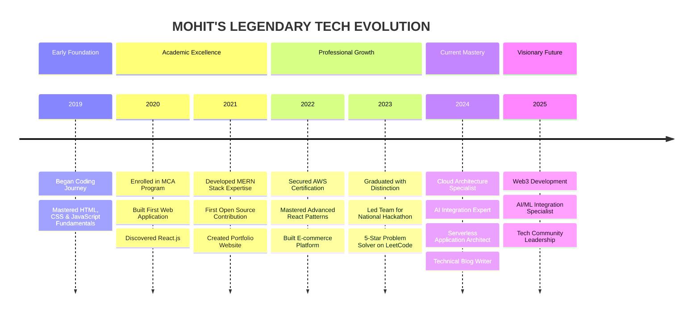

<h1 align="center">Hey Coders It's Mohit!  </h1>

<div align="center">
  


  
</div>

<div align="center">
  
</div>

<div align="center">
  
</div>

<h3 align="center">THE ARCHITECT BEHIND THE CODE</h3>

```javascript
const MOHIT = {
  title: "Software Developer",
  expertise: [
    "MERN Stack Development",
    "API Design & Integration",
    "UI/UX Desining",
    "Software Engineering",
  ],
  education: {
    degree: "MCA with Distinction",
    university: "ITER, SOA University",
    graduation: 2024,
  },
  passion: "Building scalable applications that transform user experiences",
  motto: "Code is poetry written for machines, but read by humans.",
};
```


<br>

<h3 align="center">CURRENT ENDEAVORS</h3>


- 🔥 Architecting **Dashboard Applications**
- 🚀 Developing **AI-Enhanced Full Stack Solutions**
- 🔮 Exploring **AI Integration in Web Applications**
- 📚 Sharing knowledge through **Technical Blog Posts**
- 🌟 Contributing to **High-Impact Open Source Projects**
- 🔭 I'm currently working on **AI-Enhanced MERN Applications**
- 🌱 I'm focusing on **Cloud-Native Architecture & DevOps**
- 👯 Looking to collaborate on **innovative open-source projects**
- 👨‍💻 Portfolio & projects: [mohitmalayanandy.dev](https://www.google.com/search?q=mohit+malaya+nandy)
- 📫 Reach me at: **mohit78nandy@gmail.com**
- ⚡ When not coding: **Photography, Chess, Hiking**

<br>
<h3 align="center">DEVELOPER DNA</h3>

<div align="center">
  
</div>

<div align="left">
  
```javascript
// Mohit's Developer Profile Analysis
{
  codeQuality: ["Clean", "Reusable", "Documented", "Efficient"],
  problemSolvingApproach: ["Analytical", "Creative", "Systematic"],
  specialPowers: [
    "Turning Music & Coffee Into Code",
    "Debugging In Dreams",
    "Making Complex Simple",
    "Finding Missing Semicolons In Milliseconds"
  ],
  workingHours: {
    productive: "10:00 PM - 3:00 AM",
    explanation: "When the world sleeps, code speaks louder"
  }
}
```
</div>

<br>

<h3 align="center">TECHNOLOGICAL ARSENAL</h3>

<div align="center">
  
</div>

<h3 align="center">SPECIALIZED DOMAINS</h3>
<div align="center">
<table>
  <tr>
    <th align="center" width="300">
      
    </th>
    <th align="center" width="300">
      
    </th>
    <th align="center" width="300">
      
    </th>
  </tr>
  <tr>
    <td align="center"><strong>MERN Stack Development</strong><br>
      <sub>React Ecosystems, Mongoose Modeling, Micro-Frontends, Tailwind styling</sub>
    </td>
    <td align="center"><strong>Python Developer</strong><br>
      <sub>Python Programming</sub>
    </td>
    <td align="center"><strong>API Development</strong><br>
      <sub>RESTful Design, Postman</sub>
    </td>
  </tr>
</table>
</div>

<br>
<h3 align="center">PERFORMANCE METRICS</h3>

<div align="center">
  <div style="display: flex; justify-content: center; gap: 10px; flex-wrap: wrap;">
    
    
    
    
    
    
    
  
  
  </div>
</div>

<br>

<h3 align="center">Development Metrics & Workflow</h3>
<div align="center">


| Programming Habits                                                                              | Problem Solving Focus                                                                           |
| ----------------------------------------------------------------------------------------------- | ----------------------------------------------------------------------------------------------- |
|  |  |

</div>
<br>

<h3 align="center">PRESTIGIOUS ACCOMPLISHMENTS</h3>

<div align="center">
  
</div>
<div align="center">
  <table border="0">
    <tr>
      <td align="center" width="180">
        
        <br>
        <strong>AWS Certified Solutions Architect</strong>
      </td>
      <td align="center" width="180">
        
        <br>
        <strong>MongoDB Technical Ambassador</strong>
      </td>
      <td align="center" width="180">
        
        <br>
        <strong>National Hackathon Winner</strong>
      </td>
      <td align="center" width="180">
        
        <br>
        <strong>GitHub Advanced Developer</strong>
      </td>
    </tr>
  </table>
</div>

<h3 align="center">SIGNATURE PROJECTS</h3>
<div align="center">
  <table border="0">
    <tr>
      <td width="50%" valign="top">
        <h3 align="center">🌐 FinTech Dashboard</h3>
        <p align="center">
          <a href="https://github.com/mohitmalayanandy/fintech-dashboard">
            
          </a>
          <p align="center">Comprehensive financial analytics platform with real-time data visualization</p>
        </p>
      </td>
      <td width="50%" valign="top">
        <h3 align="center">📱 Social Connect</h3>
        <p align="center">
          <a href="https://github.com/mohitmalayanandy/social-connect">
            
          </a>
          <p align="center">Feature-rich social media platform with real-time chat and content sharing</p>
        </p>
      </td>
    </tr>
    <tr>
      <td width="50%" valign="top">
        <h3 align="center">🧠 AI Image Generator</h3>
        <p align="center">
          <a href="https://github.com/mohitmalayanandy/ai-image-generator">
            
          </a>
          <p align="center">Neural network-powered application to transform text prompts into images</p>
        </p>
      </td>
      <td width="50%" valign="top">
        <h3 align="center">☁️ Cloud Infrastructure Suite</h3>
        <p align="center">
          <a href="https://github.com/mohitmalayanandy/cloud-infra-suite">
            
          </a>
          <p align="center">Automated cloud deployment solution with infrastructure-as-code templates</p>
        </p>
      </td>
    </tr>
  </table>
</div>

<h3 align="center">Featured Projects</h3>

<div align="center">
  <a href="https://github.com/mohitmalayanandy/cloud-pulse">
    
  </a>
  <a href="https://github.com/mohitmalayanandy/dev-connect">
    
  </a>
  <a href="https://github.com/mohitmalayanandy/ai-image-generator">
    
  </a>
  <a href="https://github.com/mohitmalayanandy/mern-dashboard">
    
  </a>
</div>
<br>
<h3 align="center"> Holopin Badges : </h3>

[](https://holopin.io/@mohitmalayanandy)

<br>
<h3 align="center">DEVELOPMENT JOURNEY</h3>

<div align="center">
  
</div>



<br>
<div style="display: flex; gap: 8px; justify-content: center; align-items: center; flex-wrap: wrap;">
  <!-- LinkedIn -->
  <a href="https://linkedin.com/in/mohitmalayanandy" target="_blank" style="display: inline-block;">
    
  </a>

  <!-- Twitter -->
  <a href="https://twitter.com/mohitmalaynandy" target="_blank" style="display: inline-block;">
    
  </a>

  <!-- Medium -->
  <a href="https://medium.com/@mohitmalayanandy" target="_blank" style="display: inline-block;">
    
  </a>

  <!-- Dev.to -->
  <a href="https://dev.to/mohitmalayanandy" target="_blank" style="display: inline-block;">
    
  </a>

  <!-- LeetCode -->
  <a href="https://www.leetcode.com/mohitmalayanandy" target="_blank" style="display: inline-block;">
    
  </a>

  <!-- Email -->
  <a href="mailto:mohit78nandy@gmail.com" target="_blank" style="display: inline-block;">
    
  </a>
</div>
<br>
<h3 align="center">THOUGHT LEADERSHIP</h3>
<div align="center">
  <table border="0">
    <tr>
      <td align="center">
        
        <p><strong>Architecting Scalable MERN Applications</strong><br>A deep dive into building enterprise-grade applications</p>
      </td>
      <td align="center">
        
        <p><strong>AWS Cloud Architecture Patterns</strong><br>Best practices for cost-effective, resilient cloud solutions</p>
      </td>
      <td align="center">
        
        <p><strong>AI Integration in Modern Web Apps</strong><br>Leveraging machine learning in frontend applications</p>
      </td>
    </tr>
  </table>
</div>

<h3 align="center">RHYTHM BEHIND THE CODE</h3>
<div style="text-align: center; margin-top: 40px;">
  <div style="display: inline-block; transition: transform 0.4s ease, box-shadow 0.4s ease;"
       onmouseover="this.style.transform='scale(1.05)'; this.style.boxShadow='0 0 15px rgba(83,177,79,0.6)'"
       onmouseout="this.style.transform='scale(1)'; this.style.boxShadow='none'">
    
  </div>

  <p style="color: #999; font-size: 14px; margin-top: 8px; font-family: monospace;">
    Real-time beats while coding ⚡ synced from Spotify
  </p>
</div>
<br>
<h3 align="center">Developer Personality</h3>
<div style="display: flex; justify-content: center; gap: 20px;">
    <div style="width: 45%;">
      <h4>🌙 Night Owl</h4>
      <div style="background-color: #0D1117; border-radius: 5px; height: 20px; position: relative; overflow: hidden;">
        <div style="background-color: #6E57F7; height: 100%; width: 85%; border-radius: 5px;"></div>
      </div>
      <p align="right">85%</p>
    </div>
    <div style="width: 45%;">
      <h4>🌞 Early Bird</h4>
      <div style="background-color: #0D1117; border-radius: 5px; height: 20px; position: relative; overflow: hidden;">
        <div style="background-color: #6E57F7; height: 100%; width: 15%; border-radius: 5px;"></div>
      </div>
      <p align="right">15%</p>
    </div>
  </div>
  
  <div style="display: flex; justify-content: center; gap: 20px;">
    <div style="width: 45%;">
      <h4>🧠 Problem Solver</h4>
      <div style="background-color: #0D1117; border-radius: 5px; height: 20px; position: relative; overflow: hidden;">
        <div style="background-color: #6E57F7; height: 100%; width: 90%; border-radius: 5px;"></div>
      </div>
      <p align="right">90%</p>
    </div>
    <div style="width: 45%;">
      <h4>🎨 Creative Thinker</h4>
      <div style="background-color: #0D1117; border-radius: 5px; height: 20px; position: relative; overflow: hidden;">
        <div style="background-color: #6E57F7; height: 100%; width: 70%; border-radius: 5px;"></div>
      </div>
      <p align="right">70%</p>
    </div>
  </div>
</div>

<br>
<h3 align="center">SUPPORT THE ARCHITECT</h3>

<div align="center">
  <a href="https://www.buymeacoffee.com/mohitmalaynandy" target="_blank">
    
  </a>
</div>

<br>
<div align="center">
  
</div>
<br>
<div align="center">
  
</div>
