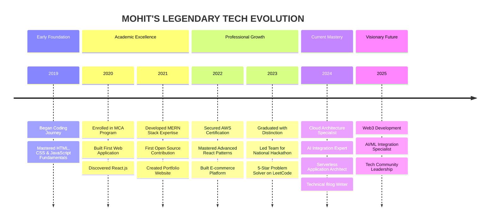

# <div align="center">⚡️ MOHIT MALAYA NANDY ⚡️</div>

<div align="center">
  
</div>

<div align="center">
  
</div>

<div align="center">
  
[](https://github.com/mohitmalayanandy?tab=followers)
[](https://github.com/mohitmalayanandy?tab=repositories)
[](https://github.com/mohitmalayanandy)
[](https://github.com/mohitmalayanandy)
[](https://github.com/sponsors/mohitmalayanandy)
  
</div>

<div align="center">
  
</div>

<br>

##  THE ARCHITECT BEHIND THE CODE


```javascript
const MOHIT = {
  title: "𝙋𝙧𝙞𝙣𝙘𝙞𝙥𝙖𝙡 𝙎𝙤𝙛𝙩𝙬𝙖𝙧𝙚 𝘼𝙧𝙘𝙝𝙞𝙩𝙚𝙘𝙩",
  expertise: [
    "MERN Stack Development",
    "Cloud Architecture (AWS)",
    "API Design & Integration",
    "System Architecture",
    "UI/UX Engineering"
  ],
  education: {
    degree: "MCA with Distinction",
    university: "ITER, SOA University",
    graduation: 2023
  },
  passion: "Building scalable applications that transform user experiences",
  motto: "Code is poetry written for machines, but read by humans."
};
```

###  CURRENT ENDEAVORS

- 🔥 Architecting **Serverless Microservices Applications**
- 🚀 Developing **AI-Enhanced Full Stack Solutions**
- 🔮 Exploring **Blockchain Integration in Web Applications**
- 📚 Sharing knowledge through **Technical Blog Posts**
- 🌟 Contributing to **High-Impact Open Source Projects**

<br>

##  DEVELOPER DNA

<div align="center">
  
</div>

<div align="center">
  
```javascript
// Mohit's Developer Profile Analysis
{
  codeQuality: ["Clean", "Reusable", "Documented", "Efficient"],
  problemSolvingApproach: ["Analytical", "Creative", "Systematic"],
  specialPowers: [
    "Turning Coffee Into Code",
    "Debugging In Dreams",
    "Making Complex Simple",
    "Finding Missing Semicolons In Milliseconds"
  ],
  workingHours: {
    productive: "10:00 PM - 3:00 AM",
    explanation: "When the world sleeps, code speaks louder"
  }
}
```
  
</div>

<br>

##  TECHNOLOGICAL ARSENAL

<div align="center">
  
</div>

<div align="center">
  <h3>SPECIALIZED DOMAINS</h3>
  
  <table border="0">
    <tr>
      <td width="300px" align="center">
        
        <br>
        <strong>Frontend Architecture</strong>
        <br>
        <small>React Ecosystems, State Management, Micro-Frontends</small>
      </td>
      <td width="300px" align="center">
        
        <br>
        <strong>Cloud Infrastructure</strong>
        <br>
        <small>AWS Services, Serverless Architecture, CI/CD Pipelines</small>
      </td>
      <td width="300px" align="center">
        
        <br>
        <strong>API Development</strong>
        <br>
        <small>RESTful Design, GraphQL, Real-time Communication</small>
      </td>
    </tr>
  </table>
</div>

<br>

## 📊 PERFORMANCE METRICS

<div align="center">
  <div style="display: flex; justify-content: space-around;">
    
    
  </div>
</div>

<div align="center">
  
</div>

<br>

## 🏆 PRESTIGIOUS ACCOMPLISHMENTS

<div align="center">
  
</div>

<div align="center">
  <table border="0">
    <tr>
      <td align="center" width="180">
        
        <br>
        <strong>AWS Certified Solutions Architect</strong>
      </td>
      <td align="center" width="180">
        
        <br>
        <strong>MongoDB Technical Ambassador</strong>
      </td>
      <td align="center" width="180">
        
        <br>
        <strong>National Hackathon Winner</strong>
      </td>
      <td align="center" width="180">
        
        <br>
        <strong>GitHub Advanced Developer</strong>
      </td>
    </tr>
  </table>
</div>

<br>

## 🚀 SIGNATURE PROJECTS

<div align="center">
  <table border="0">
    <tr>
      <td width="50%" valign="top">
        <h3 align="center">🌐 FinTech Dashboard</h3>
        <p align="center">
          <a href="https://github.com/mohitmalayanandy/fintech-dashboard">
            
          </a>
          <p align="center">Comprehensive financial analytics platform with real-time data visualization</p>
        </p>
      </td>
      <td width="50%" valign="top">
        <h3 align="center">📱 Social Connect</h3>
        <p align="center">
          <a href="https://github.com/mohitmalayanandy/social-connect">
            
          </a>
          <p align="center">Feature-rich social media platform with real-time chat and content sharing</p>
        </p>
      </td>
    </tr>
    <tr>
      <td width="50%" valign="top">
        <h3 align="center">🧠 AI Image Generator</h3>
        <p align="center">
          <a href="https://github.com/mohitmalayanandy/ai-image-generator">
            
          </a>
          <p align="center">Neural network-powered application to transform text prompts into images</p>
        </p>
      </td>
      <td width="50%" valign="top">
        <h3 align="center">☁️ Cloud Infrastructure Suite</h3>
        <p align="center">
          <a href="https://github.com/mohitmalayanandy/cloud-infra-suite">
            
          </a>
          <p align="center">Automated cloud deployment solution with infrastructure-as-code templates</p>
        </p>
      </td>
    </tr>
  </table>
</div>

<br>

## 📈 DEVELOPMENT JOURNEY

<div align="center">
  
</div>



<br>

## 🌐 DIGITAL FOOTPRINT

<div align="center">
  <a href="https://linkedin.com/in/mohitmalayanandy" target="_blank">
    
  </a>
  <a href="https://twitter.com/mohitmalaynandy" target="_blank">
    
  </a>
  <a href="https://medium.com/@mohitmalayanandy" target="_blank">
    
  </a>
  <a href="https://dev.to/mohitmalayanandy" target="_blank">
    
  </a>
  <a href="https://www.leetcode.com/mohitmalayanandy" target="_blank">
    
  </a>
  <a href="mailto:mohit78nandy@gmail.com" target="_blank">
    
  </a>
</div>

<br>

## 📝 THOUGHT LEADERSHIP

<div align="center">
  <table border="0">
    <tr>
      <td align="center">
        
        <p><strong>Architecting Scalable MERN Applications</strong><br>A deep dive into building enterprise-grade applications</p>
      </td>
      <td align="center">
        
        <p><strong>AWS Cloud Architecture Patterns</strong><br>Best practices for cost-effective, resilient cloud solutions</p>
      </td>
      <td align="center">
        
        <p><strong>AI Integration in Modern Web Apps</strong><br>Leveraging machine learning in frontend applications</p>
      </td>
    </tr>
  </table>
</div>

## 🎵 RHYTHM BEHIND THE CODE

<div align="center">
  
</div>

<br>

## 🏆 SUPPORT THE ARCHITECT

<div align="center">
  <a href="https://www.buymeacoffee.com/mohitmalaynandy" target="_blank">
    
  </a>
</div>

<br>

<div align="center">
  
</div>

<div align="center">
  
</div>
